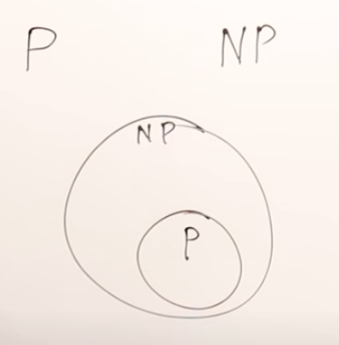
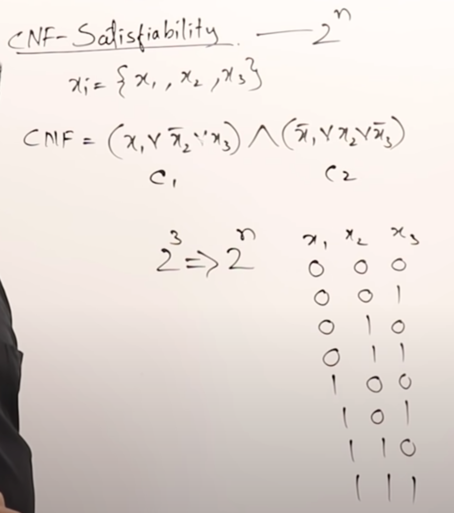
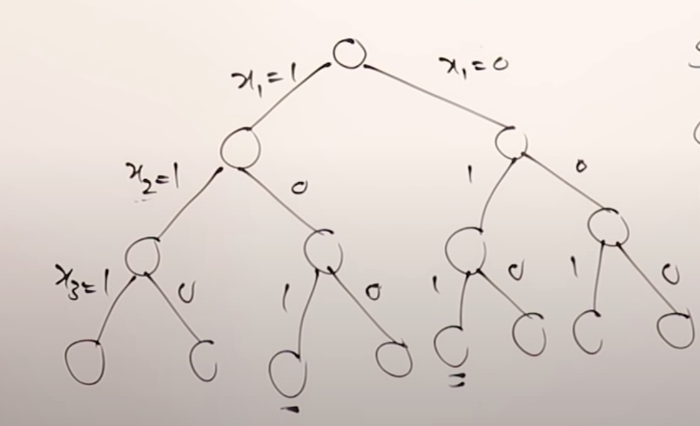
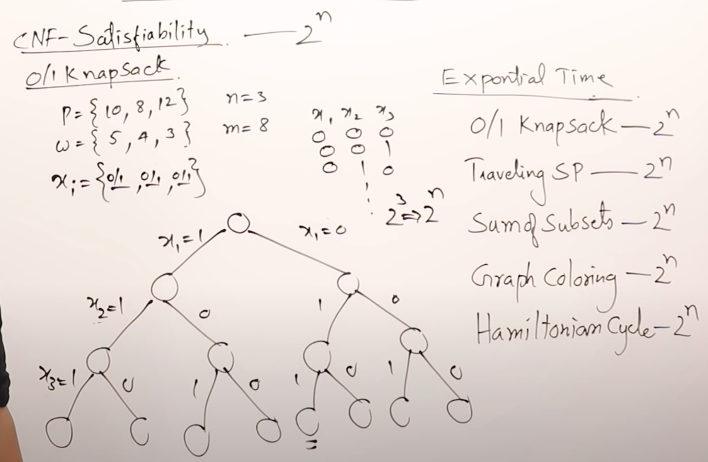
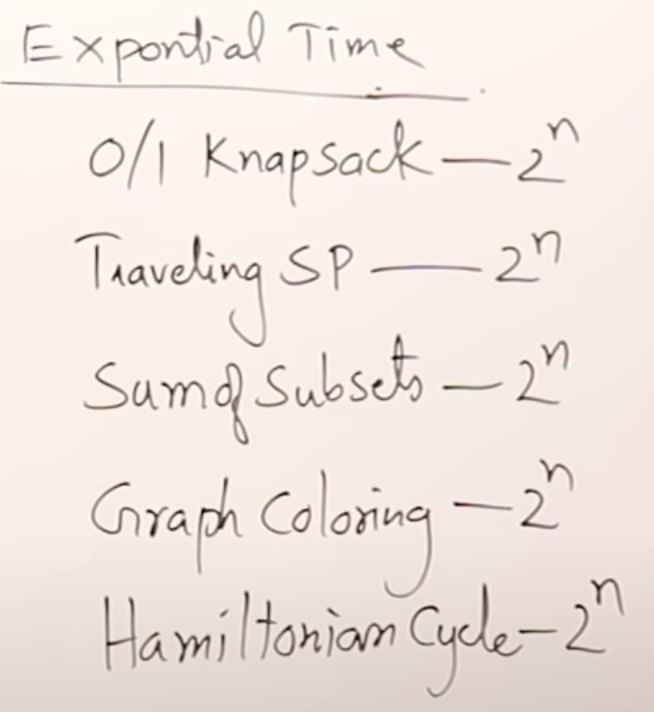
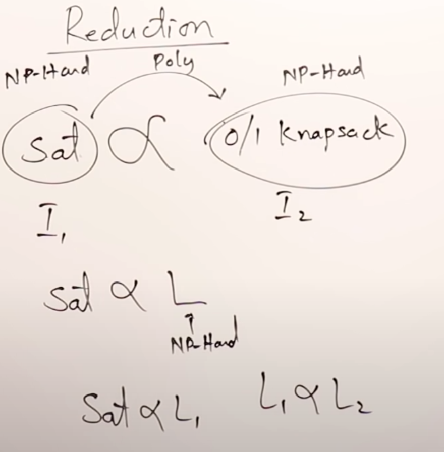
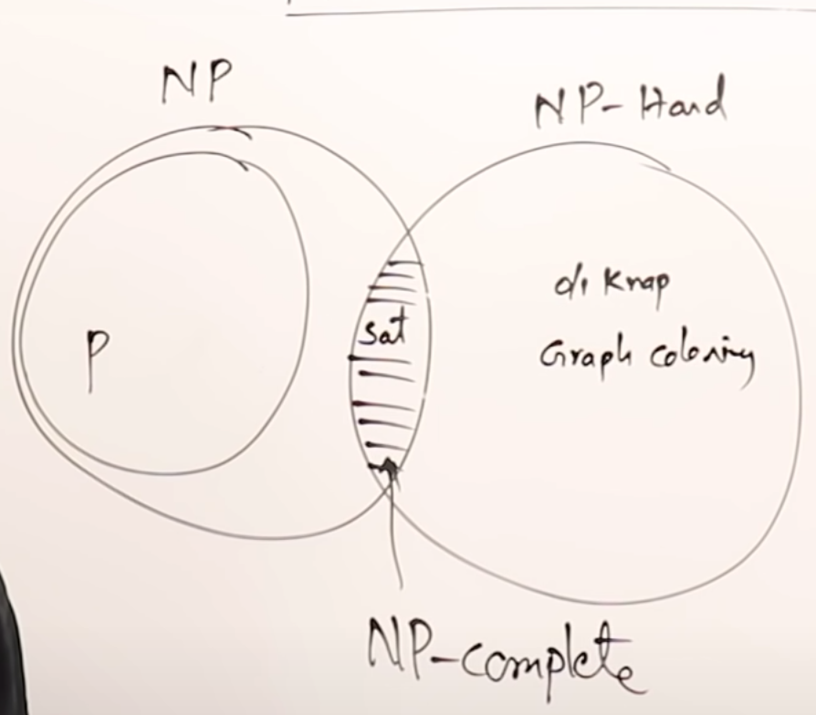

# Polinomial time algorithm 
- Linear search `O(n)`
- Binary search `O(logn)`
- Insertion sort `O(n^2)`
- Matrix multiplications `O(n^3)`
# Exponential time algorithm
- 0/1 knapsack problem `O(2^n)`
- Traveling salesman problem `O(2^n)`
- Sum of subsets `O(2^n)`
- Graph coloring `O(2^n)`
- Hamiltonial Cycle `O(2^n)`
Goal: Solve these exponential time algo in polinomial time. 
Few key points
- `n^3` is smaller than `2^n` for large value of `n`
- `n^10` is smaller than `2^n` for large value of `n`
- `n^100` is smaller than `2^n` for large value of `n`
# What is `NP hard` and `NP Complete`?
Guideline to do the research on solving expoenential time alog in polinomial time.
- If you can't write polininomial time deterministic algorithm, write polininomial time non deterministic algorithm
- Group expoential time algo in such a mannger that if one is solve in that group in polinomial time then rest can also be solved in polinomial time.
# Deterministic Algo
- Each and every statement show how it works
- We know how it works
# Non Deterministic Algo
- We don't know how it works
- It does have many deterministic steps along with non determinisitc steps
Following is one example
```
NSearch(A, n, key) {
    j = choice(); // non deterministic step
    if(key == A[j]) {
        write(j);
        success(); // non deterministic step
    }
    write(0);
    failure();  // non deterministic step
}
```
- We don't know how non determinstic step work
- we don't know how `choice()` returned `j`
- Write expoential time alog in non determinisitc steps to achieve polinomial time algo
# P class
- Determinisitc algo which takes polinomial time
# NP class
- Non determinisitc algo which takes polinomial time
- `P` is subset of `NP`
- Today we know `P` algo was `NP` in past.
- Today we know `NP` might become `P` in future


# Satisfiability problem
## Conjunctive normal form (CNF)

- Represent soln as state space tree

- Each path to leaf node is a soln
## Solve 0/1 knapscak problem using state space tree

## What is common? 
- State space tree
# Hard problem
Let's say following are hard problem

# NP Hard class
- Satisfiability taken as base problem is called `NP Hard`
## How to show relations?
- Using reduction
- We can proove that Satisfiability can be reduced to `0/1` knapsack problem
- If `0/1` can be solved using polinomial time then satisfiability problem can also be solved in polinomial time.


# NP Complete class
- If you wrote NP alogorithm then it is called NP Complete
- Satisfiability is also categoriazed as NP Complete

# Reference 
https://www.youtube.com/watch?v=e2cF8a5aAhE